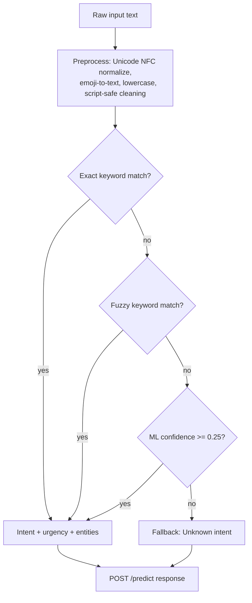
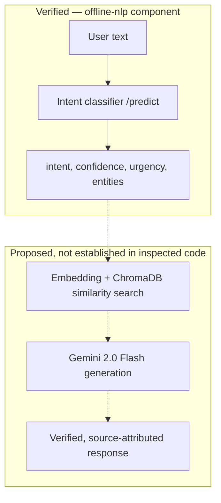

# QSAFE Nepal — Offline-First Architecture

This document describes the offline-first architecture of QSAFE Nepal as
supported by the project proposal and by verified evidence about the
codebase. It replaces the previous
`QSAFE Offline-First Architecture & NLP Tracker` document, which mixed
architecture description with a task tracker, completion percentages,
and several claims not supported by either the proposal or verified code.

---

## 0. Source Status — read this before trusting anything below

This document was built from three kinds of evidence, each tagged
inline wherever it's used:

- **`[PROPOSAL]`** — `QSAFE_Nepal_Proposal.pdf`. Authoritative for
  intended scope.
- **`[PRIOR CODE AUDIT]`** — findings from a separate, earlier audit of
  the actual `offline-nlp` Python component (its files were inspected
  directly: `src/engine.py`, `src/api.py`, `src/model.py`,
  `tests/test_engine.py`, `datasets/intents.md`, `OFFLINE_NLP_PLAN.md`,
  README, and the legacy `node-nlp.js` files). This is the only tier of
  "actual codebase" evidence available for this document.
- **`[OLD DOC, UNVERIFIED]`** — a claim that appears in the previous
  tracker document but is confirmed by **neither** the proposal nor the
  prior code audit. No Node.js backend, no `frontend/app.js`, no
  `sw.js`, and no `localStorage` outbox were inspected by anyone in this
  conversation. These claims are carried into this document only where
  they don't contradict `[PROPOSAL]`, and are explicitly marked as
  unverified — they are not being asserted as true.

**No live codebase was supplied for this task.** If the actual
repository is available, the `[OLD DOC, UNVERIFIED]` items below should
be checked against it directly before anyone treats them as fact.

---

## 1. Audit of the Previous Document

| Claim in old doc                                                                            | Verdict                                                                                                          | Basis                                                                                                                                                                                                                                                                                                                                                                                                                                                                                                   |
| ------------------------------------------------------------------------------------------- | ---------------------------------------------------------------------------------------------------------------- | ------------------------------------------------------------------------------------------------------------------------------------------------------------------------------------------------------------------------------------------------------------------------------------------------------------------------------------------------------------------------------------------------------------------------------------------------------------------------------------------------------- |
| "25 distinct disaster intents"                                                              | **`[CONTRADICTED BY PROPOSAL]`, `[SUPPORTED BY CODE]`**                                                | Proposal §3.3 and §4.3.1 (Table 4.5) define exactly**two** intents — Safety Query and Emergency/Damage Request, ~200 total training utterances. The prior code audit found the actual sklearn engine implements **25** fine-grained intents, an intentional, documented migration (per `OFFLINE_NLP_PLAN.md`). Real divergence, not a bug — see §9.                                                                                                                                  |
| "100% Complete" (dataset/intent taxonomy)                                                   | **`[UNSUPPORTED PHRASING]`**                                                                             | "100%" implies conformance to a spec. Since the code diverges from the proposal's 2-intent spec by design, "100% complete" against*what* is undefined. Removed.                                                                                                                                                                                                                                                                                                                                       |
| Python NLU engine — tiered keyword→fuzzy→ML→fallback, 27/27 tests                       | **`[SUPPORTED BY CODE]`** (tiering, testing existing) / **`[UNVERIFIED]`** (exact "27/27" count) | Prior audit confirmed the tiered`IntentEngine.predict()` pipeline and confirmed a null/non-string-input regression was found and fixed with new tests added. Exact current test count wasn't independently re-confirmed here.                                                                                                                                                                                                                                                                         |
| FastAPI microservice on port`5000`, "95% Complete"                                        | **`[PARTIALLY CONTRADICTED]`**                                                                           | Prior audit found the CLI's actual default port is**8000**; `OFFLINE_NLP_PLAN.md` says the Node backend *expects* 5000 — this was flagged as an **unresolved integration caveat**, not something already resolved. Stating "port 5000" as settled fact is inaccurate.                                                                                                                                                                                                                  |
| Node.js bridge (`nlpClient.js`, `ragService.js`)                                        | **`[OLD DOC, UNVERIFIED]`**                                                                              | No Node backend was in scope for the prior code audit (it was explicitly noted as outside the audited zip). Neither confirmed nor denied.                                                                                                                                                                                                                                                                                                                                                               |
| Browser-side NLU engine,`frontend/app.js`, full 25-intent parity, trilingual NDRRMA cards | **`[OLD DOC, UNVERIFIED]`**                                                                              | No frontend files were inspected by anyone in this conversation.                                                                                                                                                                                                                                                                                                                                                                                                                                        |
| Confidence threshold "0.25 for 25-class space"                                              | **`[SUPPORTED BY CODE]`, unresolved vs proposal**                                                        | Prior audit confirmed the shipped`CONFIDENCE_THRESHOLD = 0.25`. Proposal §3.11.5 specifies **0.70** (for its 2-intent design); the in-repo `intents.md` spec recommends a tiered 0.55/0.40. Three different numbers exist across three sources — this is a real, unresolved team decision, not a documentation error to silently fix. See §9.                                                                                                                                              |
| `localStorage` SOS outbox with automatic background flush, "90% Complete"                 | **`[OLD DOC, UNVERIFIED]`**, and **internally inconsistent**                                       | Not inspected. Also, the same old document's own "Work Remaining" section separately lists "Background Auto-Sync" as a not-yet-done Phase 3 item — contradicting the "90% Complete... automatic background flush" claim made in the status matrix a few lines above it.                                                                                                                                                                                                                                |
| Persistence via`localStorage`                                                             | **`[CONTRADICTS PROPOSAL]`**                                                                             | Proposal §3.5.2 and §3.10.1 specify**sql.js** (SQLite compiled to WebAssembly) as the local persistence mechanism for damage reports, not `localStorage`. `LocalForage`/`localStorage` is described in the proposal only as a wrapper for app state and cache blobs (§3.10.1), not as the damage-report store. If the actual implementation uses `localStorage` for reports, that's a proposal deviation worth flagging to the team, not something to describe as the intended design. |
| Service Worker v4, static asset caching                                                     | **`[OLD DOC, UNVERIFIED]`** but plausible                                                                | Consistent in kind with proposal §3.5.1 (service workers cache static assets/pre-loaded data). Version number and specific behavior not verified.                                                                                                                                                                                                                                                                                                                                                      |
| "IndexedDB" (planned)                                                                       | **`[NOT IN PROPOSAL]`**                                                                                  | Proposal specifies sql.js/WASM SQLite, not IndexedDB, for structured local data. LocalForage may use IndexedDB as a backing store for app state (§3.10.1), but that's a different concern than the damage-report datastore.                                                                                                                                                                                                                                                                            |
| GPS coordinates in offline reports                                                          | **`[PARTIALLY SUPPORTED]`**                                                                              | Proposal §4.1.1 lists "location (district or GPS)" as a damage-report input field, so location capture is in scope. Proposal's Security non-functional requirement (§1.6.5d) separately requires reports to exclude personally identifiable information — precise GPS is arguably in tension with that and isn't reconciled by the proposal itself. Flag, don't resolve silently.                                                                                                                    |
| "Emergency dispatch endpoint"                                                               | **`[NOT ESTABLISHED]`**                                                                                  | No dispatch system appears anywhere in the proposal. The proposal's actual requirement (§1.6.4e) is store-locally-then-sync-when-online, nothing more. "Dispatch" implies routing to responders, which isn't specified.                                                                                                                                                                                                                                                                                |
| "Disaster-grade," "true grid-down resilience," "production-grade offline standard"          | **`[UNSUPPORTED / REMOVED]`**                                                                            | Marketing language not grounded in any source. The proposal frames this as an achievable 8-week undergraduate minor project (Abstract), not a production disaster-response system. Removed from the architecture description below.                                                                                                                                                                                                                                                                     |
| Trilingual: English, Devanagari Nepali, Romanized Nepali                                    | **`[SUPPORTED BY CODE]`**, broader than literal proposal text                                            | Prior code audit confirmed the dataset genuinely contains English, Devanagari Nepali, and Romanized (Latin-script) Nepali, with zero rows of true Devanagari+Latin code-mixing in one message despite the old README's "code-mixed" claim. Proposal itself only says "English, Nepali (Unicode)" (§1.6.4a) without naming a Romanized mode explicitly, but this is a reasonable, code-confirmed elaboration, not a contradiction.                                                                      |
| Emergency hotline numbers (100 / 102 / 16666)                                               | **`[SUPPORTED BY PROPOSAL]`**                                                                            | Matches §1.4 and §4.1.3 exactly.                                                                                                                                                                                                                                                                                                                                                                                                                                                                      |
| "RAG" via`ragService.js` routing to static trilingual cards                               | **`[NOT ESTABLISHED AS RAG]`**                                                                           | See §5. Routing an intent to a pre-written multilingual template is not retrieval-augmented generation as the proposal defines it (embedding + vector similarity search + LLM generation, §3.2). The prior code audit found**no embeddings, vector DB, or LLM inside the only backend component actually inspected** (`offline-nlp`). Calling template lookup "RAG" overstates what's verified.                                                                                               |

---

## 2. What QSAFE Nepal Is `[PROPOSAL]`

A bilingual (English / Nepali) PWA earthquake-safety assistant for
Nepal, intended to remain partially usable without connectivity. Three
proposal-defined feature areas: a safety-query bot grounded in NDRRMA
manual content, a locally-stored/later-synced damage reporter, and an
offline emergency directory — plus, when online, live USGS seismic
telemetry.

---

## 3. Architecture Layers — included only where evidence supports them

| Layer                                                                        | Status                                                                                                                                                                                          | Evidence                                                               |
| ---------------------------------------------------------------------------- | ----------------------------------------------------------------------------------------------------------------------------------------------------------------------------------------------- | ---------------------------------------------------------------------- |
| User Interface / Frontend (PWA)                                              | `[PROPOSAL]` intended; `[UNVERIFIED]` in current code                                                                                                                                       | React.js + Vite specified (§1.6.1); no frontend files inspected here. |
| Offline Client / Local Fallback                                              | `[PROPOSAL]` intended (service worker + sql.js); `[UNVERIFIED]` in current code                                                                                                             | §3.5.                                                                 |
| NLP / Intent Classification                                                  | `[VERIFIED — SUPPORTED BY CODE]`                                                                                                                                                             | The only component with direct file-level confirmation. See §4.       |
| Backend Gateway                                                              | `[PROPOSAL]` — undecided between Express.js/FastAPI (§4.1.2 literally says "or"); `[VERIFIED, narrow]` — a **FastAPI `/predict` service exists** for the NLP layer specifically. | See §1 audit row on port/backend.                                     |
| RAG / Knowledge Retrieval (ChromaDB + Gemini)                                | `[PROPOSAL]` describes this; `[NOT ESTABLISHED]` in the only code actually inspected                                                                                                        | See §5.                                                               |
| Data / Knowledge Sources (NDRRMA manual, intent corpus, USGS seismicity CSV) | `[PROPOSAL]`; intent corpus `[VERIFIED]`, NDRRMA chunk store and USGS ingestion `[UNVERIFIED]`                                                                                            | §4.2.                                                                 |
| Emergency Reporting / Routing                                                | `[PROPOSAL]` (store locally, sync later); dispatch/GPS specifics `[NOT ESTABLISHED]`                                                                                                        | See §1 audit rows.                                                    |
| Connectivity / Synchronization                                               | `[PROPOSAL]` describes 3 states (online/degraded/offline, §3.5.2); implementation detail `[UNVERIFIED]`                                                                                    | See §6.                                                               |

No mesh networking, SMS fallback, peer-to-peer sync, satellite
comms, GPS live tracking, or authentication system appears in any
source — none of these belong in this architecture.

---

## 4. NLP Architecture

**As proposed** `[PROPOSAL §3.3, §3.11.5]`: NLP.js running in Node.js,
2 intents (Safety Query, Emergency/Damage Request), Naïve Bayes +
pattern matching, confidence threshold 0.70, English/Nepali language
detection via character n-grams and the Devanagari Unicode range.

**As verified in code** `[PRIOR CODE AUDIT]`: this was **replaced**,
per the repo's own migration note, with a Python/scikit-learn engine
(TF-IDF word+char features → LogisticRegression), 25 intents, a
confidence threshold of 0.25, and a tiered pipeline:

This is confirmed working and tested against English, Devanagari
Nepali, Romanized Nepali, and edge cases (`None`, non-string, empty,
whitespace, very long, emoji-only input) `[PRIOR CODE AUDIT]`. It has
**no coverage for genuine Devanagari+Latin code-mixed input** in a
single message — none exists in the training data.

This is a real divergence from the proposal's 2-intent NLP.js design,
not an error to "fix." It should be recorded as a team decision, not
silently reverted or silently kept — see §9.

---

## 5. RAG / Knowledge Retrieval

**As proposed** `[PROPOSAL §3.2]`: NDRRMA manual → chunked → embedded
via Google `text-embedding-004` → stored in ChromaDB → query embedded
the same way → cosine-similarity search → if similarity ≥ threshold,
chunks passed to Gemini 2.0 Flash as generation context → response with
source attribution; below threshold, a fallback message with no
generation.

**As verified in code** `[PRIOR CODE AUDIT]`: the only backend
component actually inspected (`offline-nlp`) is an **intent
classifier only** — it returns `{intent, confidence, source, urgency, entities, recommended_action}` from a fixed vocabulary. It contains
**no embedding call, no vector database, and no LLM call**. This
matches the in-repo `datasets/intents.md` framing of the component as
"NLU-only, doesn't generate answers."

**Conclusion:** whether the proposal's actual RAG pipeline
(ChromaDB + Gemini) exists anywhere in the wider system is
**`[NOT ESTABLISHED]`** by any evidence available for this document. If
a Node/Express service implementing that pipeline exists, it hasn't
been inspected here. Any document (including the previous tracker)
that describes template-based intent-to-response routing as "RAG" is
overstating it — template lookup and retrieval-augmented generation are
different mechanisms, and only the former has been confirmed to exist.

---

## 6. Online / Offline Boundary

This section states only what the proposal defines as the intended
boundary `[PROPOSAL §3.5.2]`. Actual implementation status of each cell
is unverified except where noted.

| Capability                                      | Online                             | Degraded (server down, device online)                                     | Offline          |
| ----------------------------------------------- | ---------------------------------- | ------------------------------------------------------------------------- | ---------------- |
| Safety-query chat (RAG-grounded)                | ✅ Proposed                        | ❌ Proposed                                                               | ❌ Proposed      |
| Cached safety rules / emergency directory       | ✅                                 | ✅ Proposed                                                               | ✅ Proposed      |
| Damage report submission (local save)           | ✅                                 | ✅ Proposed                                                               | ✅ Proposed      |
| Damage report sync to server                    | ✅                                 | ❌ (queued)                                                               | ❌ (queued)      |
| Live USGS seismic telemetry                     | ✅                                 | ❌                                                                        | ❌               |
| Intent classification (`offline-nlp` service) | ✅`[VERIFIED — service exists]` | Depends on whether it runs locally or requires network —`[UNVERIFIED]` | `[UNVERIFIED]` |

The proposal never claims the RAG-based chat works offline — only the
cached directory and locally-stored reporting are specified as
offline-capable. Any document implying full offline chat
functionality is not supported.

---

## 7. Emergency Reporting / Routing `[PROPOSAL §4.1.1, §1.6.4e]`

- Fields: location (district or GPS), damage type, severity level,
  optional description, timestamp.
- Stored locally (sql.js per proposal — see §1 audit row on
  `localStorage` vs sql.js) when offline; synced to the backend when
  connectivity returns.
- No PII in reports (proposal non-functional requirement, §1.6.5d).
- No dispatch, triage-to-responder, or emergency-services integration
  is specified anywhere — this is a locally-logged, later-synced report,
  not an emergency dispatch system.

---

## 8. Known Limitations & Open Items

Carried forward from prior findings, not resolved here — these are
team decisions, not documentation bugs:

- **Confidence threshold**: 0.70 (proposal, 2-intent) vs 0.55/0.40 tiers
  (in-repo `intents.md`, 25-intent) vs 0.25 (shipped code). Unresolved.
- **Port**: FastAPI CLI default 8000 vs Node backend's expected 5000
  per `OFFLINE_NLP_PLAN.md`. Unresolved integration caveat.
- **Intent count**: proposal's 2 vs shipped 25. Intentional divergence,
  undocumented in the proposal itself.
- **RAG pipeline existence**: not established outside the NLU-only
  component. If it exists elsewhere in the codebase, it needs its own
  audit before this document can describe it as real.
- **Persistence mechanism**: proposal specifies sql.js; old tracker
  describes `localStorage`. Needs reconciling against actual frontend
  code.
- **Devanagari+Latin code-mixed input**: zero training coverage despite
  earlier documentation implying support.
- **Legacy Node/NLP.js files** (`train.js`, `test.js`, `corpus.json`,
  `model.nlp.json`) reportedly still present in the repo alongside the
  Python engine that replaced them — a maintenance/confusion risk, not
  a functional bug.

---

## 9. What This Document Deliberately Does Not Claim

- No completion percentages. "Percent complete" against a spec the code
  intentionally diverged from (2 vs 25 intents) is not a meaningful
  number, and no source here establishes ground truth for any other
  component's completion.
- No claim that the frontend, Node backend, service worker, or sync
  logic work as described in the old tracker — none of those files were
  inspected for this document.
- No RAG, vector database, or LLM integration is asserted as
  implemented, anywhere in the system, beyond what the proposal
  proposes.
- No dispatch, GPS live-tracking, IndexedDB, mesh networking, or
  production-grade resilience claims.
- No new architecture, service, or abstraction has been introduced.
  This document only describes and audits what the supplied sources
  already establis

# 🛡️ QSAFE Offline-First Architecture & NLP Tracker

**Target System:** Resilient Disaster Response Assistant for Nepal
**Scope:** Zero-connectivity offline inference, multilingual triage (EN / Devanagari NE / Romanized NE), client-side PWA fallback, and offline SOS caching.

---

## 📊 Status Matrix

| Component                                     | Status      |  Completion %  | Key Capabilities & Files                                                                                                                        |
| --------------------------------------------- | ----------- | :------------: | ----------------------------------------------------------------------------------------------------------------------------------------------- |
| **1. Dataset & Intent Taxonomy**        | 🟢 Complete | **100%** | 25 distinct disaster intents across English, Devanagari, and Romanized Nepali (`offline-nlp/datasets/`)                                       |
| **2. Python NLU Engine**                | 🟢 Complete | **100%** | Tiered inference (Exact Keyword -> Fuzzy -> TF-IDF/ML -> Fallback) with Urgency & Entity Extraction (`offline-nlp/src/`, 27/27 tests passing) |
| **3. Microservice & Backend Bridge**    | 🟢 Complete | **95%** | FastAPI`/predict` microservice hooked into Node.js `nlpClient.js` and `ragService.js`                                                     |
| **4. In-Browser Client Offline Engine** | 🟢 Complete | **95%** | Full 25-intent taxonomy, sub-categorized medical trauma, urgency detection, and trilingual NDRRMA cards in`frontend/app.js`                   |
| **5. Offline SOS Queue & Sync**         | 🟢 Complete | **90%** | `localStorage` outbox with automatic background flush on reconnect & visual sync toasts                                                       |
| **6. Service Worker Resilience**        | 🟢 Complete | **95%** | SW v4 static asset caching and graceful offline fallback routing (`frontend/sw.js`)                                                           |

---

## 🛠️ Work Done (Accomplished)

### A. NLP Data Engineering & Model Pipeline

- [X] **25 Disaster Intents Defined:** Categorized into Rescue/SOS (`trapped_debris_report`, `sos_help_request`), Medical (`first_aid_query`, `injury_report`), Hazards (`earthquake_occurring_report`, `landslide_hazard_query`, `flood_occurring_report`), and Logistical (`emergency_contact_request`, `safe_location_query`).
- [X] **Trilingual Corpus & Augmentation:** Ingested native Devanagari Nepali, Romanized phonetic Nepali, and English training sets.
- [X] **Unicode Normalization:** NFC enforcement across data pipelines, eliminating OS-level CP1252/ANSI Mojibake issues.
- [X] **Confidence Guardrails:** Calibrated multi-class classification confidence thresholds (`0.25` for 25-class space) to avoid premature fallbacks on code-mixed inputs.
- [X] **Rule + ML Hybrid Engine:** Instant 0ms keyword/fuzzy fast-path for critical hotwords (`earthquake`, `bhukampa`, `मद्दत`, `pahiro`) combined with TF-IDF ML fallback for conversational sentences.
- [X] **Urgency & Triage Tagging:** Automated `HIGH` / `MEDIUM` / `LOW` urgency tagging based on exclamation, all-caps, and life-threatening triggers (`trapped`, `bleeding`, `help`).
- [X] **Automated Test Suite:** 27 unit & integration tests passing in `offline-nlp/tests/test_engine.py`.

### B. Client-Side Browser NLU Engine (True Grid-Down Resilience)

- [X] **Full 25-Intent Taxonomy in Frontend:** Integrated comprehensive keyword/regex rules directly in `frontend/app.js` (`matchLocalIntent`).
- [X] **Granular NDRRMA Protocol Cards:** High-impact safety protocols across `en`, `ne_dev`, and `ne_rom` for:
  - Trapped in debris / building collapse
  - Severe bleeding vs burns vs fractures vs general first aid
  - Landslides & mudslides
  - Flash floods & river inundation
  - Fire safety & evacuation
  - Emergency go-bag checklist
  - National emergency hotlines
  - Safe open-ground assembly points
- [X] **Urgency-Triggered Visual Triage:** Life-critical queries automatically trigger high-contrast red alert cards and highlighted dialing buttons (`urgent-dial`, `urgent-card`).
- [X] **Offline Distress Outbox & Auto-Sync:** SOS reports entered during offline connectivity loss are buffered in `localStorage` and automatically flushed with a sync toast upon network recovery.
- [X] **Service Worker v4 Upgrade:** Stale cache eviction and robust static asset caching in `frontend/sw.js`.

### B. Backend NLP Integration

- [X] **FastAPI Service:** Exposes `POST /predict` on port `5000` via `offline-nlp/src/api.py`.
- [X] **Node.js Client Adapter:** `backend/src/services/nlpClient.js` with timeout protection and offline graceful degradation.
- [X] **Language-Locked Orchestration:** `backend/src/services/ragService.js` routes detected intents into trilingual emergency safety cards.

---

## 🚧 Work Remaining (To Reach Full Disaster-Grade Offline Standard)

### Phase 1: Client-Side Browser NLU Parity (Zero-Server Independence)

*When cell towers or local servers go down, the browser PWA must run standalone.*

- [ ] **Port Intent & Keyword Rules to Browser Engine:** Upgrade `matchLocalIntent()` in `frontend/app.js` with the full 25-intent taxonomy from the Python engine.
- [ ] **Trilingual Granular Safety Protocols:** Expand `LOCAL_KNOWLEDGE_BASE` in `app.js` to provide specific protocols for:
  - Trapped in debris / building collapse
  - Bleeding vs burns vs fractures
  - Active flood evacuation vs landslide avoidance
  - Fire and electrical hazards

### Phase 2: Emergency Triage & Golden-Hour Prioritization

- [ ] **Urgency Banner & Visual Cueing:** If a query contains high-urgency triggers (e.g., `"trapped under wall"` or `"रगत धेरै बगिरहेको छ"`), highlight immediate emergency dialing buttons (100, 102) above all text.
- [ ] **Action-First Imperative Formatting:** Re-format all offline response cards with 3-step action points:
  1. 🛑 **IMMEDIATE HAZARD ACTION** (Drop/Cover/Move)
  2. 🩹 **IMMEDIATE LIFE-SAVING ACTION** (Pressure/Splint/Airway)
  3. 📞 **EMERGENCY HOTLINE CALL** (Direct clickable tel link)

### Phase 3: Offline Disaster Incident Logging & Sync

- [ ] **IndexedDB / LocalStorage SOS Outbox:** If the user sends a distress message or damage report while offline, save it with timestamp, GPS coordinates (if permitted), and message text.
- [ ] **Background Auto-Sync:** When `window.addEventListener('online')` fires, automatically flush queued reports to the backend emergency dispatch endpoint.

### Phase 4: Full End-to-End Verification

- [ ] **Disaster Scenario Benchmarking:** Run a suite of 20 simulated field queries across EN, Devanagari, and Romanized Nepali in 100% offline flight mode.
